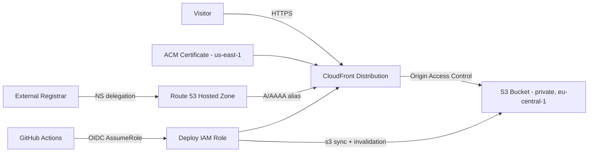

# Architecture

Static website hosting for **snapmotorsports.com** on AWS, managed with Terraform and deployed via GitHub Actions.

## Overview



Visitors reach the site over HTTPS through CloudFront. CloudFront reads files from a private S3 bucket in `eu-central-1` using Origin Access Control (OAC). DNS is managed in Route 53. Deployments are pushed from GitHub Actions using short-lived OIDC credentials — no AWS access keys are stored in GitHub.

## AWS resources

| Resource | Name / ID | Region | Purpose |
|---|---|---|---|
| S3 bucket | `snap-motorsports-site` | eu-central-1 | Stores static site files |
| CloudFront distribution | `E3KRL50U0HQM7E` | Global | CDN, HTTPS termination, caching |
| CloudFront OAC | `snap-motorsports-oac` | Global | Restricts S3 access to CloudFront only |
| Route 53 hosted zone | `snapmotorsports.com` | Global | DNS management |
| ACM certificate | DNS-validated | us-east-1 | TLS cert for CloudFront (AWS requirement) |
| IAM OIDC provider | GitHub Actions | Global | Keyless authentication for CI/CD |
| IAM role | `snap-motorsports-github-deploy` | Global | Scoped deploy permissions |

### Why us-east-1 for ACM?

CloudFront only accepts ACM certificates from the `us-east-1` region. This is an AWS platform constraint. No site content or traffic is stored there — the certificate is metadata used for TLS.

## Request flow

1. A visitor requests `https://snapmotorsports.com`.
2. Route 53 resolves the domain to the CloudFront distribution (A/AAAA alias records).
3. CloudFront terminates TLS using the ACM certificate.
4. CloudFront fetches the object from the private S3 bucket via OAC.
5. If the object is cached at the edge, CloudFront serves it directly.
6. Missing objects (403/404) are mapped to `/404.html`.

## Security model

- **S3 bucket is private.** All public access is blocked. Only the CloudFront distribution can read objects, enforced by a bucket policy scoped to the distribution ARN.
- **HTTPS only.** CloudFront redirects HTTP to HTTPS (`redirect-to-https` viewer policy).
- **No long-lived AWS keys in GitHub.** The deploy workflow uses OIDC to assume `snap-motorsports-github-deploy`, which is scoped to:
  - `s3:ListBucket`, `s3:GetObject`, `s3:PutObject`, `s3:DeleteObject` on the site bucket
  - `cloudfront:CreateInvalidation`, `cloudfront:GetInvalidation` on the distribution

## Naming and tagging

All named resources use the `snap-motorsports` prefix. Every resource is tagged via Terraform provider `default_tags`:

| Tag | Value |
|---|---|
| Project | snap-motorsports |
| Environment | prod |
| ManagedBy | terraform |

## Terraform layout

```
infra/
├── versions.tf      # Provider config (eu-central-1 default, us-east-1 alias for ACM)
├── variables.tf     # Domain, region, GitHub repo, naming
├── route53.tf       # Hosted zone and DNS records
├── acm.tf           # TLS certificate and DNS validation
├── s3.tf            # Private bucket and OAC bucket policy
├── cloudfront.tf    # CDN distribution, OAC, error responses
├── iam.tf           # GitHub OIDC provider and deploy role
└── outputs.tf       # Nameservers, CloudFront URL, bucket name, role ARN
```

Terraform state is stored locally in `infra/terraform.tfstate` (gitignored). A remote backend (S3 + DynamoDB locking) can be added later if needed.

## Two-phase deployment

Infrastructure is applied in two phases because the ACM certificate requires DNS validation, and the domain is registered at an external registrar.

### Phase 1 — Base infrastructure (`enable_custom_domain = false`)

Creates all resources. CloudFront uses its default `*.cloudfront.net` certificate and is immediately reachable at:

```
https://dv6ow0540rgx4.cloudfront.net
```

Route 53 nameservers (set these at your registrar):

```
ns-1054.awsdns-03.org
ns-2021.awsdns-60.co.uk
ns-393.awsdns-49.com
ns-619.awsdns-13.net
```

### Phase 2 — Custom domain (`enable_custom_domain = true`)

After registrar NS delegation propagates:

```bash
cd infra
terraform apply -var="enable_custom_domain=true"
```

This will:

1. Wait for ACM certificate validation via DNS
2. Attach `snapmotorsports.com` and `www.snapmotorsports.com` as CloudFront aliases
3. Switch CloudFront to the ACM certificate
4. Create Route 53 A/AAAA alias records for apex and www

## CI/CD pipeline

The **Deploy Site** workflow (`.github/workflows/deploy.yml`) runs on:

- Push to `main` when files in `site/` or the workflow itself change
- Manual trigger via `workflow_dispatch`

Steps:

1. Checkout repository
2. Assume `snap-motorsports-github-deploy` via OIDC (`AWS_DEPLOY_ROLE_ARN` repo variable)
3. `aws s3 sync site/ s3://snap-motorsports-site --delete`
4. `aws cloudfront create-invalidation --paths "/*"`

## CloudFront configuration

| Setting | Value |
|---|---|
| Default root object | `index.html` |
| Price class | `PriceClass_100` (Europe + North America) |
| IPv6 | Enabled |
| Compression | Enabled |
| Cache TTL | Default 3600s, max 86400s |
| Custom errors | 403 and 404 → `/404.html` |

## Cost considerations

This architecture is designed for low cost at moderate traffic:

- **S3** — pennies per GB stored and transferred
- **CloudFront** — free tier covers 1 TB/month outbound; `PriceClass_100` limits edge locations
- **Route 53** — $0.50/month per hosted zone + $0.40/million queries
- **ACM** — free for public certificates
- **GitHub Actions** — free tier for public repos
